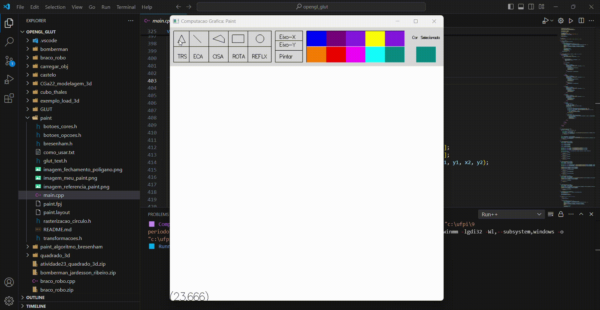
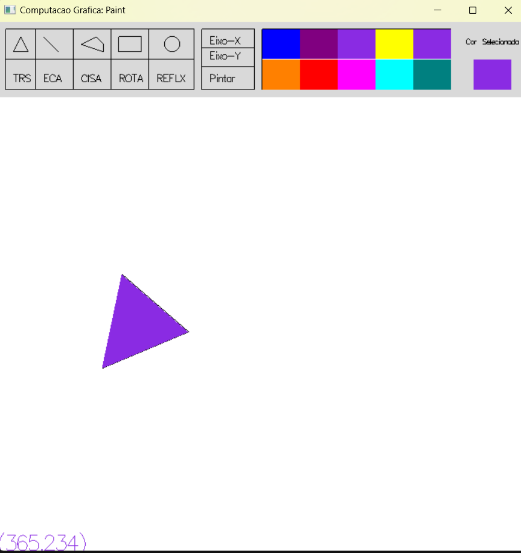

# UFPI - Computação Gráfica

Esse repositório contém as atividades práticas com OpenGL para a disciplina de Computação Gráfica

#### Atenção:
  - A execução dos códigos foram feitas de acordo com a configuração própria para o VSCode. Por tanto, é preciso executar o código que esteja na pasta configurada. Além disso, é preciso baixar uma extenção no VSCode para auxiliar na execução dos códigos.

## Resultados

#### Atividade 4 - Jogo do Bomberman 3D
 - Jogo na visão em 3° pessoa

 - Jogo na visão em 1° pessoa

#### Atividade 3 - Paint utilizando algoritmos de preenchimento e rasterização

#### Atividade 2 - Braço Robô com primitivas 3D

#### Atividade 1 - Castelo com primitivas 2D

