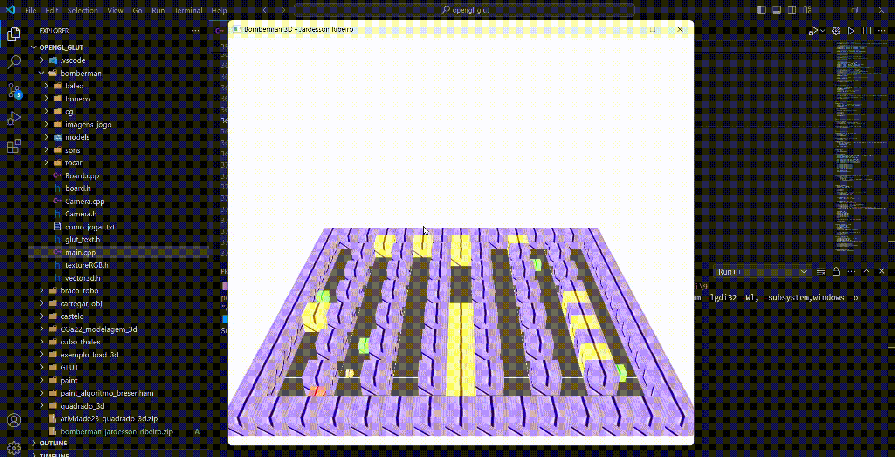

# Jogo do Bomberman 3D

 - O jogo foi desenvolvido usando o openglut.
 - A mecânica do jogo foi inspirado no jogo do Bomberman, implementado para utilizar fundamentos da computação gráfica.
 
### Mecânica do Jogo

#### Visão 3° pessoa
 - W para frente
 - S para trás
 - A para esquerda
 - D para direita

#### Visão 1° pessoa
 - W vira a câmera para frente
 - S vira a câmera para trás
 - A vira a câmera para esquerda
 - D vira a câmera para direita
 - P "caminha" no sentido da câmera

#### Outros comandos
 - C alterna a câmera
 - B solta a bomba

### Imagens do Jogo

#### Vídeo 3° pessoa

#### Vídeo 1° pessoa

