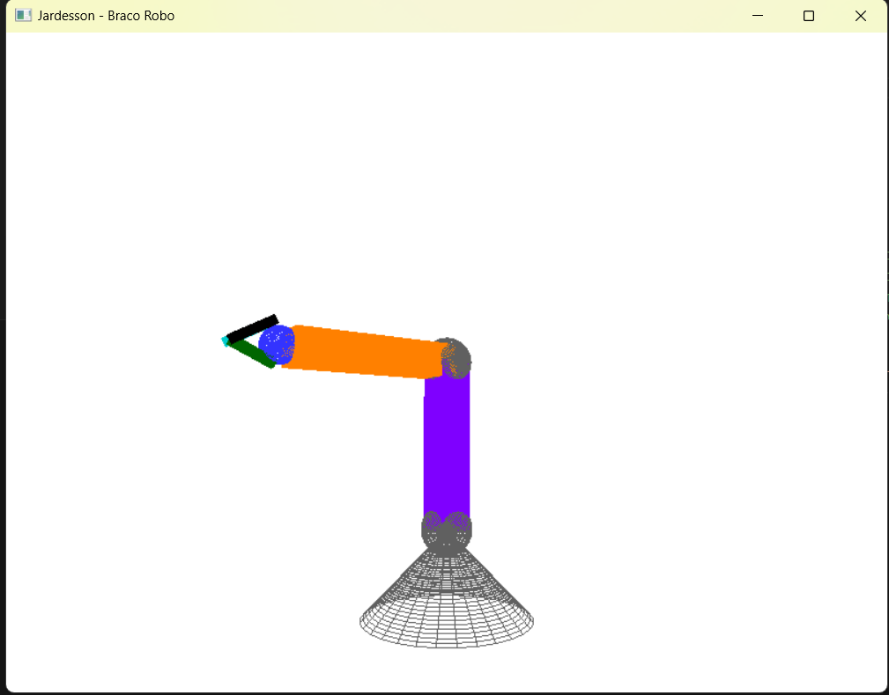
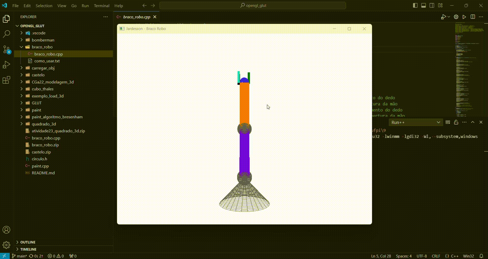

## Braço Robô 3D com OpengGl

#### Imagem

#### Vídeo

#### Comandos

Formas de usar:
 - c(minúsculo) rotaciona o antebraço sobre seu eixo 'z' - sentido horário
 - C(maiúsculo) rotaciona o antebraço sobre seu eixo 'z' - sentido anti-horário
 - y(minúsculo) rotaciona o braço sobre seu eixo 'y' - sentido horário
 - Y(maiúsculo) rotaciona o braço sobre seu eixo 'y' - sentido anti-horário
 - m(minúsculo) rotaciona a mão sobre seu eixo 'y' - sentido horário
 - M(maiúsculo) rotaciona a mão sobre seu eixo 'y' - sentido anti-horário
 - a(minúsculo) rotaciona o dedo anelar sobre seu eixo 'z' - sentido horário semelhante ao fechamento do dedo
 - A(maiúsculo) rotaciona o dedo anelar sobre seu eixo 'z' - sentido anti-horário semelhante a abertura da mão
 - i(minúsculo) rotaciona o dedo indicador sobre seu eixo 'z' - sentido horário semelhante ao fechamento do dedo
 - I(maiúsculo) rotaciona o dedo indicador sobre seu eixo 'z' - sentido anti-horário semelhante a abertura da mão
 - p(minúsculo) rotaciona o dedo polegar sobre seu eixo 'z' - sentido anti-horário semelhante ao fechamento do dedo
 - P(maiúsculo) rotaciona o dedo polegar sobre seu eixo 'z' - sentido horário semelhante a abertura da mão
 - f(minúsculo) fecha toda a mão
 - F(maiúsculo) abre toda a mão
 - ESC - para sair
